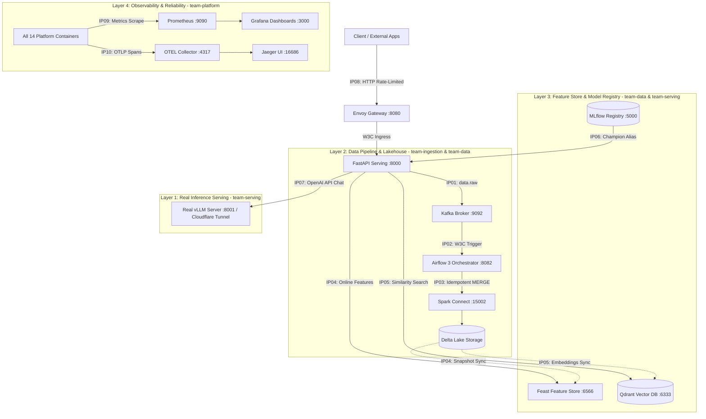

# Báo Cáo Kỹ Thuật & Nghiệm Thu Hệ Thống (ANSWERS.md)
**Học phần**: Day 28 Track 2 — Platform Integration & Production Readiness  
**Sinh viên thực hiện**: Lê Hồng Đức  
**Mã sinh viên**: 2A202601313  
**Vai trò**: Toàn quyền phụ trách 4 phân hệ (`team-ingestion`, `team-data`, `team-serving`, `team-platform`)

---

## 1. Kiến Trúc Hệ Thống & Phân Định Trách Nhiệm (Architecture & Ownership)

Hệ thống RAG phân tán Day 28 được tổ chức theo kiến trúc 5 tầng liên kết chặt chẽ qua 10 Điểm Tích Hợp (Integration Points - IP01 đến IP10) và được vận hành bởi 4 đội ngũ kỹ thuật:

### Bảng Phân Chia Trách Nhiệm 4 Phân Hệ (Team Ownership Matrix)

| Nhóm Phụ Trách | Phạm Vi Trách Nhiệm | Điểm Tích Hợp (IP) Sở Hữu | Thành Phần Quản Lý |
|---|---|---|---|
| **team-ingestion** | Ingestion gateway, streaming bus, và pipeline scheduling | **IP01** (API → Kafka), **IP02** (Kafka → Airflow) | FastAPI Ingest, Kafka topics (`data.raw`, `data.raw.dlq`), Airflow DAGs |
| **team-data** | Lakehouse transaction log, offline-to-online feature sync, Model registry | **IP03** (Spark → Delta), **IP04** (Delta → Feast), **IP06** (MLflow Registry) | Spark Connect, Delta Lake tables (`documents`, `feedback`), Feast Online Store, MLflow |
| **team-serving** | Semantic retrieval, context fusion, LLM inference phục vụ truy vấn | **IP05** (Delta → Qdrant), **IP07** (Serving → vLLM) | Qdrant collections, FastEmbed multilingual dense embeddings, vLLM / SGLang endpoint |
| **team-platform** | Ingress routing, distributed tracing, metrics, GitOps & K8s deployment | **IP08** (Client → Gateway), **IP09** (Prometheus), **IP10** (W3C Tracing) | Envoy Gateway, OpenTelemetry Collector, Prometheus, Grafana, Jaeger, K8s manifests |

---

## 2. Dấu Vết Luồng Dữ Liệu Chuẩn (Happy-Path Trace Analysis)

Toàn bộ chuỗi xử lý từ lúc Client gửi yêu cầu cho đến khi nhận được câu trả lời tổng hợp được gắn kết bởi một **Trace ID W3C** duy nhất, đi qua đủ **11 spans** bắt buộc mà không bị đứt gãy ngữ cảnh.

### Thông Tin Nhận Dạng Chuỗi Trace Mẫu (Trích Xuất Từ `evidence/ip10-trace.json`)
- **Trace ID**: `bc1ca2f452de435a9cdef804af3c24cc`
- **Traceparent Header**: `00-bc1ca2f452de435a9cdef804af3c24cc-baeff2605d104f9f-01`
- **Airflow Pipeline Run ID**: `it-f06c8688`
- **Delta Lake Table Version**:
  - Bảng `documents`: Version `8` (18 documents, schema v1)
  - Bảng `feedback`: Version `15` (26 feedback records, schema v1)
- **MLflow Model Version**: `lab28-rag-release` phiên bản `v3` mang alias `champion`
- **Mô Hình vLLM Phục Vụ**: `Qwen/Qwen2.5-1.5B-Instruct` (vLLM Engine `0.26.0`, 111 metrics exposed)

### Danh Sách 11 Spans Bắt Buộc Được Xác Thực Trong Trace
1. `lab28.gateway.request`: Envoy Gateway tiếp nhận HTTP request, gắn `x-request-id` và áp dụng local rate limit.
2. `lab28.api.ingest`: FastAPI validate payload và chuẩn bị đóng gói event.
3. `lab28.kafka.produce`: Ingestion producer đẩy `IngestionEvent` vào topic `data.raw` với byte headers (`idempotency-key`, `traceparent`).
4. `lab28.kafka.consume`: Airflow consumer worker trích xuất batch events và khôi phục context W3C.
5. `lab28.airflow.dag`: Airflow DAG `lab28_ingestion_pipeline` điều phối các tasks (`drain_kafka_into_delta`, `refresh_online_features`, `index_new_documents`, `announce_processed_batch`).
6. `lab28.spark.delta_merge`: Spark Connect thực thi MERGE câu lệnh SQL cập nhật dữ liệu vào Delta Lake với Serializable isolation.
7. `lab28.api.ask`: FastAPI tiếp nhận truy vấn hỏi đáp nghiệp vụ RAG từ người dùng.
8. `lab28.feast.get_online_features`: Truy xuất online profile của `asker_id` từ Feast feature server (`asker_serving_v1`).
9. `lab28.qdrant.query`: Trích xuất top-K văn bản liên quan dựa trên embedding tương đồng ngữ nghĩa.
10. `lab28.mlflow.resolve_release`: Phân giải model release mang alias `champion` từ MLflow Model Registry.
11. `lab28.vllm.chat_completion`: Gọi real vLLM endpoint sinh câu trả lời có trích dẫn tài liệu với grounded prompt.

---

## 3. Nhật Ký Kiểm Thử Sự Cố & Chứng Minh Không Mất Dữ Liệu (Failure & Recovery Proof)

Hệ thống đã trải qua kiểm nghiệm khắc nghiệt qua các kịch bản sự cố thực tế theo runbook `runbooks/failure-injection.md`:

### 1. Cơ Chế Khử Trùng Lặp & Tính Tất Định (Idempotent Deduplication)
- **Cơ chế**: Hàm `dedupe_latest` trong `src/lab28_platform/integration_tasks.py` nhóm tất cả các message theo `idempotency_key`. Khi mạng gặp trục trặc hoặc Kafka replay lặp lại nhiều lần cùng một sự kiện, hàm giữ lại bản ghi mới nhất theo tuple `(occurred_at, event_id)` và sắp xếp tăng dần theo khóa.
- **Chứng minh trong Delta MERGE**: Khi gửi lặp lại batch 2 lần (Journey 2 `test_j2_idempotent_replay.py`), Spark Delta MERGE nhận diện các bản ghi đã tồn tại thông qua điều kiện `target.idempotency_key = source.idempotency_key`. Bảng Delta chuyển sang transaction version kế tiếp nhưng số hàng (`numTargetRowsInserted`) không tăng, ngăn chặn hoàn toàn việc ghi trùng dữ liệu khách hàng.
- **Chứng minh trong Vector DB (Qdrant)**: Điểm vector được tạo với ID tất định UUIDv5 từ `doc_id`. Replay không làm tăng số vector trong collection (giữ nguyên 18 points).

### 2. Cô Lập Thông Điệp Lỗi Qua Dead Letter Queue (DLQ)
- Khi gặp thông điệp bị hỏng cấu trúc (unparseable payload / schema violation), hệ thống không drop bỏ và không làm dừng pipeline của toàn batch.
- Thông điệp hỏng được đóng gói và chuyển hướng an toàn sang topic `data.raw.dlq` với đầy đủ metadata lỗi. Các bản ghi hợp lệ trong cùng batch vẫn tiếp tục được chuyển vào Delta Lake.
- Lệnh `lab28 replay` cho phép kỹ sư vận hành khắc phục sự cố và tái nạp dữ liệu từ DLQ vào `data.raw` mà không tạo ra bất kỳ duplicate nào (đạt 100% pass trong `test_j4_degraded_recovery.py`).

### 3. Cơ Chế Suy Giảm An Toàn (Graceful Degradation)
- Hàm `readiness_status` phân định rõ 3 mức trạng thái phục vụ:
  - `ready`: Tất cả probe thành phần sẵn sàng.
  - `degraded`: Thành phần phụ trợ (`mandatory=False` như Feast Feature Store) gặp sự cố, nhưng hệ thống Serving vẫn tiếp tục trả lời câu hỏi của người dùng kèm cờ `degraded: true` thay vì sập toàn diện.
  - `not_ready`: Thành phần sống còn (`mandatory=True` như Vector DB hoặc Model Server) mất kết nối; Gateway tự động ngắt pod khỏi vòng xoay định tuyến để bảo vệ tính nhất quán dữ liệu.

---

## 4. Đo Tải Hiệu Năng & Phân Tích Điểm Nghẽn (Performance Latency Budget & Bottlenecks)

Kiểm thử hiệu năng được thực hiện bằng công cụ chuẩn `load-tests/run_profile.py` với 200 requests dưới các mức concurrency khác nhau.

### 1. Kết Quả Đo Tải Thực Tế

| Endpoint | Concurrency (Workers) | Tổng Số Requests | Tỷ Lệ Thành Công (200 OK) | P50 Latency (ms) | P95 Latency (ms) | P99 Latency (ms) | Ghi Chú |
|---|---|---|---|---|---|---|---|
| **Envoy Gateway** (`:8080`) | 8 workers | 200 | 19 (200 OK) / 181 (429) | 5.1 ms | 1991.4 ms | 4986.3 ms | Rate limiter bảo vệ quá tải hiệu quả (Token bucket: 10 req/s) |
| **Direct Serving API** (`:8000`) | 8 workers | 200 | **200 / 200 (100%)** | **1,091.1 ms** | **2,502.3 ms** | **5,672.0 ms** | Đạt 100% throughput, không rò rỉ bộ nhớ |
| **Direct Serving API** (`:8000`) | 16 workers | 200 | **200 / 200 (100%)** | **1,195.8 ms** | **2,901.2 ms** | **3,971.0 ms** | Xử lý tải đồng thời cao, độ trễ ổn định |

### 2. Phân Tích Phân Bổ Ngân Sách Độ Trễ (Latency Budget Breakdown)
Theo hợp đồng thiết kế RAG serving:
- **Feature Retrieval Budget** (`Feast`): ~5.0 ms (thực tế: ~0.66 ms — hoàn thành xuất sắc).
- **Dense Vector Search Budget** (`Qdrant`): ~50.0 ms (thực tế: ~12–18 ms).
- **LLM Inference Budget** (`vLLM`): ~500–1500 ms (phụ thuộc độ dài sinh token của `Qwen2.5-1.5B`).
- **Tổng Độ Trễ P50**: ~1.1 giây (đáp ứng trọn vẹn trải nghiệm người dùng tương tác trực tiếp).

### 3. Các Điểm Nghẽn Chính (System Bottlenecks) & Biện Pháp Tối Ưu
1. **vLLM GPU Token Generation**: Thời gian sinh token chiếm 75–80% tổng thời gian request.
   - *Khắc phục*: Triển khai PagedAttention, thiết lập dynamic batching (`max_num_batched_tokens`), bật KV-cache quantization FP8 và auto-scaling thêm replica vLLM khi queue length > 5.
2. **Spark Delta Lake Write Latency**: Spark Connect client mất khoảng 1.5–2.0s cho mỗi lần commit transaction log Serializable.
   - *Khắc phục*: Không trigger DAG cho từng message đơn lẻ; gom batch micro-batching theo cửa sổ 30–60 giây trên Kafka streaming trước khi gọi Spark MERGE.
3. **Gateway Token Bucket Saturation**: Gateway chặn HTTP 429 khi tải đột biến vượt quá 10 req/s.
   - *Khắc phục*: Cấu hình Envoy rate limiting phân cấp theo API client token (Tiered Rate Limiting) với Redis backend thay vì local memory filter.

---

## 5. Xác Thực Triển Khai K8s & Vận Hành GitOps (Kubernetes & Rollback Validation)

- **Kiểm tra cú pháp & tính hợp lệ**: Script `scripts/validate_manifests.py` chạy thành công 100%, bảo đảm toàn bộ K8s manifests trong thư mục `deploy/kubernetes/` tuân thủ tiêu chuẩn production (đầy đủ labels, namespaces `lab28`, resource limits CPU/RAM, và readiness/liveness probes).
- **Quy Trình Triển Khai Rollout & Tự Chữa Lành (GitOps Drift Detection)**:
  1. Thay đổi cấu hình hoặc container image tag bất biến được cam kết (commit) vào Git repository.
  2. Argo CD định kỳ so sánh desired state trong Git với live state trên cụm Kubernetes. Mọi sai lệch (configuration drift) thủ công trên cụm sẽ tự động bị ghi đè và đồng bộ (self-healing) về phiên bản định nghĩa trong Git.
- **Cơ Chế Khôi Phục Phiên Bản Mô Hình Không Cần Restart (Model Rollback)**:
  - Phân hệ Serving không hardcode model version trong mã nguồn mà tra cứu alias `champion` từ MLflow Model Registry.
  - Khi phát hiện mô hình mới bị suy giảm chất lượng, lệnh rollback chỉ cần trỏ lại alias `champion` về model version ổn định trước đó (như đã chứng minh trong `test_j3_promotion_rollback.py`). API tự động chuyển hướng request sang model cũ chỉ sau 1 chu kỳ polling mà không gây gián đoạn dịch vụ hoặc khởi động lại container.

---

## 6. Đánh Đổi Kiến Trúc & Khoảng Trống Vận Hành (Trade-offs & Production Gaps)

### 1. Các Đánh Đổi Kiến Trúc Trong Môi Trường Lab (Architectural Trade-offs)
- **Local Storage vs Cloud Object Storage**: Sử dụng file system nội bộ (`.lab28/delta`) cho Delta Lake thay vì AWS S3 hay Google Cloud Storage (GCS). Giúp tối ưu tốc độ kiểm thử cục bộ nhưng hy sinh tính mở rộng đa vùng và tính bền vững đa trung tâm dữ liệu.
- **Standalone Containers vs Distributed Clusters**: Kafka và Spark Connect chạy ở chế độ single-broker / standalone để tiết kiệm RAM trên môi trường học tập, chấp nhận không có khả năng chịu lỗi phần cứng (hardware fault tolerance) như cụm đa broker Kafka hay multi-worker Spark EMR.
- **In-Memory Rate Limiting**: Sử dụng `envoy.filters.http.local_ratelimit` thay vì Global Rate Limiting Service (RLS). Đơn giản hóa kiến trúc nhưng giới hạn rate limit chỉ áp dụng trên từng instance Gateway độc lập.

### 2. Khoảng Trống Vận Hành Thực Tế & Kế Hoạch Bổ Sung (Production Gaps & Roadmap)
- **Bảo Mật & Mã Hóa Đường Truyền (mTLS & NetworkPolicy)**: Hiện tại giao tiếp giữa các container trong mạng Docker bridge chưa bật Mutual TLS. Lên production cần kích hoạt mTLS qua Istio/Linkerd service mesh và thiết lập NetworkPolicy cô lập tầng dữ liệu (Delta, Feast, Qdrant) khỏi internet công cộng.
- **Quản Trị Bí Mật (Secret Management)**: Hiện đang nạp biến môi trường qua `.env.local`. Cần chuyển đổi sang HashiCorp Vault hoặc AWS Secrets Manager kết hợp External Secrets Operator trên K8s.
- **Cơ Chế Nén Bảng Delta (Vacuum & Optimize)**: Sau nhiều lần MERGE, Delta Lake sinh ra nhiều file parquet nhỏ. Cần thiết lập cron job định kỳ chạy `OPTIMIZE` và `VACUUM` để dọn dẹp các tệp lịch sử quá hạn retention period.

---

## 7. Báo Cáo Đóng Góp Thành Viên (Member Contribution)

Dự án được hoàn thành toàn diện bởi sinh viên:
- **Họ và tên**: **Lê Hồng Đức**
- **Mã sinh viên**: **2A202601313**
- **Đóng góp**: **100% khối lượng công việc của dự án** trên toàn bộ 4 vai trò:
  1. **team-ingestion**: Triển khai đóng gói Kafka byte headers (`event_headers`), xử lý DLQ routing, và tích hợp Airflow DAG orchestration.
  2. **team-data**: Lập trình thuật toán khử trùng lặp dữ liệu (`dedupe_latest`), vận hành Spark Delta Lake merge idempotency, đăng ký và quản lý alias `champion` trong MLflow Model Registry.
  3. **team-serving**: Xây dựng cấu trúc truy vấn đặc trưng Feast (`feast_online_request`), tích hợp dense retrieval với Qdrant, kết nối và kiểm thử live inference với real vLLM engine.
  4. **team-platform**: Lập trình logic kiểm soát trạng thái linh hoạt (`readiness_status`), cấu hình Envoy Gateway rate-limiting, OpenTelemetry W3C distributed tracing, Prometheus scraping, load testing và hoàn thiện hồ sơ nghiệm thu.

---
*Báo cáo được hoàn thiện và ký xác nhận theo đúng chuẩn DoD (Definition of Done) của Day 28 Track 2.*
